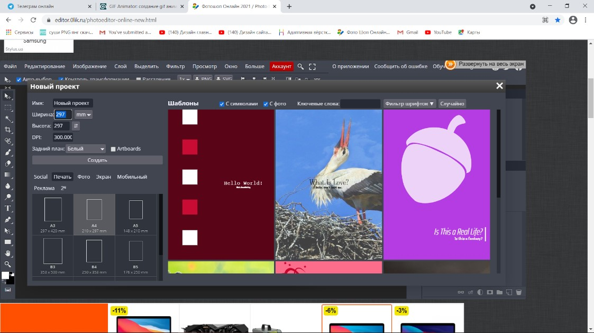

# Шаг 1

Открываем фотошоп по ссылке https://editor.0lik.ru/photoeditor-online-new.html 

# Шаг 2 

Нажимаем кнопку создать 

# Шаг 3

В высоте и ширине указываем цифру 297 мм и расширение 300 пп

Нажимаем кнопку создать 

# Шаг 4

Берем инструмент ручка ( Р ) 

# Шаг 5

Ставим точку за пределами монтажной области , ставим вторую точку выше и зажимаем ее направляем всплывшие линии по бокам. 

# Шаг 6

Ставим следующую точку и повторяем действие 6

# Шаг 7

Замыкаем фигуру- кликнув по точке с которой начинали 

# Шаг 8 

Ставим заливку. Наверху находиться цветной прямоугольник , нажимаем на него и выбираем единственный из предложенных квадратов –ПРЯМОУГОЛЬНИК и выбираем цвет- нажимаем на кнопку ок.

# Шаг 9

Повторяем шаги 6,7,8,9 ( ТОЛЬКО , фигуру рисуем чуть дальше от предыдущей (со смещением вправо ) и меняем цвет на другой (похожий по тональности)

# Шаг 10 

Переходим в папку слои с правой стороны и зажимаем верхний слой с новой фигурой, переносим ее под предыдущую, отпускаем клавишу.  

# Шаг 11

Берем снова инструмент ручка (Р) и рисуем круг, в котором будут большие цифры 

# Шаг 12

Далее пишем текст (Заголовок). Выбираем инструмент текст (Т) , ставим точку где хотим начать писать, сверху, слева изменяем его вид , размер и цвет,  пишем текст , нажимаем галочку сверху справа. 

# Шаг 13

Продолжаем наполнение текста таким же образом 

# Шаг 14

Переходим в папку *файл* , нажимаем *открыть и поместить*, помещаем картинку 

# Шаг 15

Переходим в *файл* и нажимаем экспортировать- в пнг сохраняем в папку на рабочем столе под названием *пончик*

# Шаг 16

Нажимаем Ctl+J для Копирования картинки 

# Шаг 17

Нажимаем на глазик в предыдущем слои пончика 

# Шаг 18

Нажимаем правой кнопкой по копии слоя пончика и нажимаем *растрирование*

# Шаг 19

Выбираем инструмент ласо и выделаем часть пончика (как будто бы его откусили) и нажимаем кнопку backspace, после нажимаем Ctrl+D, для снятия выделений 

# Шаг 20

Повторяем шаги с 15 по 20 ( копируем – убираем нижнего слоя видимость- обрезаем часть –сохраняем в пнг) повторяем два раз ( должно быть 4 картинки пончика в слоях )

# Шаг 21

Переходим по ссылке  https://ru.toolson.net/GifAnimation/Create и нажимаем кнопку *выбрать файл*, выбираем все картинки, сохранённые на рабочем столе в папке *пончик* 

# Шаг 22

Листаем страничку вниз и нажимам на кнопке *повторить*, после нижимаем на большую кнопку *создать*

# Шаг 23

Нажимаем на кнопку *download* и сохраняем вашу работу на Компьютер 

### ВАША ГИФ АНИМАЦИЯ ГОТОВА !))
